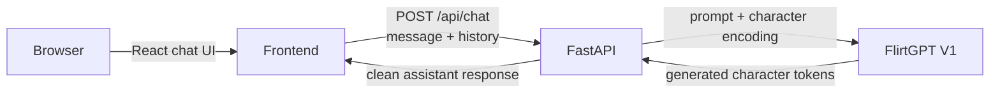

# FlirtGPT 💬

**A tiny GPT built from scratch, with a little personality.**

FlirtGPT is a character-level language model trained from scratch in PyTorch and wrapped in a modern chat interface. This project brings the existing V1 model checkpoint into a full-stack application: React on the frontend, FastAPI on the backend, and the trained `flirtgpt.pt` checkpoint generating the replies.

> FlirtGPT responses come from the locally hosted FlirtGPT model. The app does not use a third-party LLM API.

**Live API:** [gpt-from-scratch-gy1h.onrender.com](https://gpt-from-scratch-gy1h.onrender.com) · [Health check](https://gpt-from-scratch-gy1h.onrender.com/api/health)

## Highlights

- Minimal, responsive dark chat interface with a welcome screen and clickable conversation starters.
- Multi-turn conversations, typing feedback, auto-scroll, and a new-chat action.
- Keyboard-friendly composer: Enter sends; Shift + Enter adds a line.
- FastAPI endpoints for health checks and chat generation.
- Loads the existing V1 checkpoint once when the backend starts, using CUDA when available and CPU otherwise.
- Trims older conversation context to fit the model’s character-level context window.
- Validates request size and history, filters model control tokens, and keeps detailed backend errors out of the UI.

## Built with

| Layer | Technology |
| --- | --- |
| Frontend | React, Vite, Tailwind CSS, lucide-react |
| Backend | Python, FastAPI, Uvicorn, Pydantic |
| Model | PyTorch, character-level GPT implemented from scratch |
| Deployment | Render (API), any static hosting provider (frontend) |

## How it fits together



The checkpoint and model definition are intentionally separate from the interface. `backend/model.py` recreates the V1 architecture from the configuration and vocabulary stored in `flirtgpt.pt`; it does not retrain or replace the model.

## Repository layout

```text
.
├── flirtgpt.pt                  # Trained V1 checkpoint
├── flirt_gpt.ipynb              # Original model and training notebook
├── backend/
│   ├── main.py                  # FastAPI application and endpoints
│   ├── model.py                 # V1 architecture and generation wrapper
│   └── requirements.txt
└── frontend/
    ├── src/
    │   ├── components/          # Chat UI components
    │   ├── App.jsx
    │   └── main.jsx
    ├── package.json
    └── vite.config.js
```

## Run locally

You’ll need Python 3.10 or newer, Node.js, and npm. Run the API and frontend in separate terminals from the repository root.

### 1. Start the backend

```bash
cd backend
python -m venv .venv
```

Activate the environment, then install and run:

**macOS / Linux**

```bash
source .venv/bin/activate
pip install -r requirements.txt
uvicorn main:app --reload --host 0.0.0.0 --port 8000
```

**Windows PowerShell**

```powershell
.venv\Scripts\Activate.ps1
pip install -r requirements.txt
uvicorn main:app --reload --host 0.0.0.0 --port 8000
```

The backend expects `flirtgpt.pt` at the repository root. It chooses CUDA automatically when available and otherwise uses CPU.

### 2. Start the frontend

In a second terminal, from the repository root:

```bash
cd frontend
npm install
npm run dev
```

Open [http://localhost:5173](http://localhost:5173). The development API URL defaults to `http://localhost:8000` when `VITE_API_URL` is set in `frontend/.env.local`; without it, the app uses the production API URL below.

Create `frontend/.env.local` for local development:

```dotenv
VITE_API_URL=http://localhost:8000
```

Vite reads `VITE_*` variables when it starts, so restart the dev server after changing this file.

## API

### `GET /api/health`

Returns a simple service health response:

```json
{ "status": "ok" }
```

### `POST /api/chat`

Send the current message and previous turns. The history excludes the current message, which is sent separately in `message`.

```json
{
  "message": "You seem pretty confident.",
  "history": [
    { "role": "user", "content": "Hey" },
    { "role": "assistant", "content": "Hey yourself." }
  ]
}
```

Response:

```json
{ "response": "Someone has to keep up with you." }
```

The API accepts `user` and `assistant` history roles, limits each message to 2,000 characters and the history to 40 entries, and returns only the generated assistant text. The frontend also strips model control tokens defensively.

## Deploy

### Backend on Render

Create a Python Web Service connected to this repository. Set the **Root Directory** to `backend` and use:

- **Build command:** `pip install -r requirements.txt`
- **Start command:** `uvicorn main:app --host 0.0.0.0 --port $PORT`

The checkpoint must be included in the repository at its root. Configure `FLIRTGPT_CORS_ORIGINS` as a comma-separated list of the exact frontend origins allowed to call the API, for example:

```text
https://your-frontend.example,https://another-allowed-origin.example
```

The default API URL in the frontend is `https://gpt-from-scratch-gy1h.onrender.com`. Set `VITE_API_URL` in the frontend hosting provider if your backend has a different URL. Frontend environment variables are embedded during the build, so redeploy after changing them.


